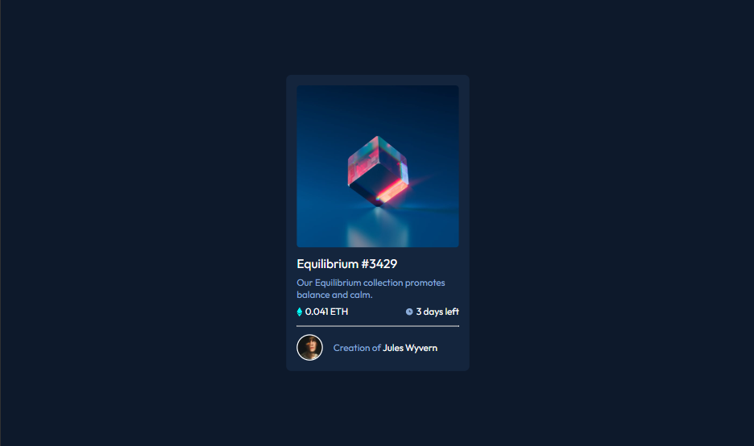

# Frontend Mentor - NFT preview card component solution

This is a solution to the [NFT preview card component challenge on Frontend Mentor](https://www.frontendmentor.io/challenges/nft-preview-card-component-SbdUL_w0U). Frontend Mentor challenges help you improve your coding skills by building realistic projects.

## Table of contents

- [The challenge](#the-challenge)
- [Screenshot](#screenshot)
- [Links](#links)
- [Built with](#built-with)
- [What I learned](#what-i-learned)
- [Continued development](#continued-development)
- [Author](#author)
- [Acknowledgments](#acknowledgments)

### The challenge

Users should be able to:

- View the optimal layout depending on their device's screen size
- See hover states for interactive elements

### Screenshot



Hope it renders well :)

### Links

- Solution URL: [NFT preview card component](https://www.frontendmentor.io/challenges/nft-preview-card-component-SbdUL_w0U)
- Live Site URL: [NFT preview card compon live site](https://jeanclaude09-dev.github.io/nft-preview-card-component-main-using-flex-box/)

### Built with

- Semantic HTML5 markup
- CSS custom properties
- Flexbox
- CSS Grid
- Desktop-first workflow

### What I learned

I’m really proud of this section of my code. I built it at 1 AM, and I love how it turned out!

```html
<div class="image-container">
  <div>
    
  </div>
  <div class="hover">
    
  </div>
</div>
```

```css
.hover {
  position: absolute;
  top: 0;
  left: 0;
  width: 100%;
  height: 100%;
  display: flex;
  align-items: center;
  justify-content: center;
  border-radius: 0.7rem;
  background-color: var(--Cyan400);
  opacity: 0;
  transition: all 0.3s;
}
.hover:hover {
  opacity: 0.7;
  cursor: pointer;
}
```

I still think that I could have done better!

### Continued development

- responsiveness

## Author

- Frontend Mentor - [@Jeanclaude09-dev](https://www.frontendmentor.io/profile/Jeanclaude09-dev)
- Twitter - [@iamjeanclaude09](https://x.com/iamjeanclaude09)
- Instagram - [@iamje_nclaude](https://www.instagram.com/iamje_nclaude/#)
